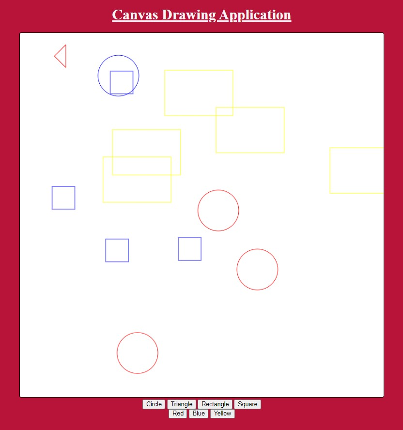

# Web Page for Paint Application

## AIM:

To design a static website for Paint Application using HTML5 canvas.

## DESIGN STEPS:

### Step 1:

Requirement collection.

### Step 2:

Creating the layout using HTML,CSS and canvas.

### Step 3:

Write javascript to capture move events.

### Step 4:

Perform the drawing operation based on the user input.

### Step 5:

Validate the layout in various browsers.

### Step 6:

Validate the HTML code.

### Step 6:

Publish the website in the given URL.

## PROGRAM :

~~~
<!DOCTYPE html>
<html>
<body id="Jaeger">
    <h1>Canvas Painting Application</h1>
    

<canvas id="myCanvas" width="800" height="800" onclick="showCoords(event)"></canvas>

<button onclick="shape=1" id="Eren" >Rectangle</button>
<button onclick="shape=2" id="Eren">Circle</button>
<button onclick="shape=4" id="Eren">Square</button>
<button onclick="shape=6" id="Eren">Triangle</button>
 

<button onclick="change_color(this)" id="Yagami" style="background: rgb(153, 0, 255);"></button>
<button onclick="change_color(this)" id="Yagami" style="background: rgb(54, 0, 124);"></button>
<button onclick="change_color(this)" id="Yagami" style="background: #f30c0c;"></button>

Developed By Yuvadarshini S

</body>
</html>

~~~

## OUTPUT:

## Result:

Thus a website is designed and validated for paint application using HTML5 canvas.
